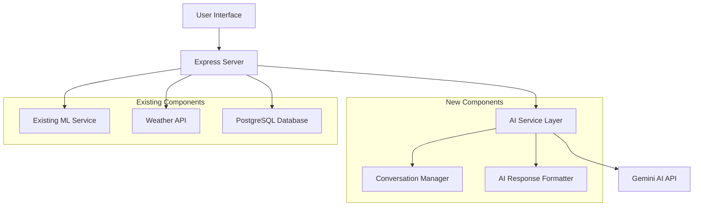

# Design Document

## Overview

The AI Agentic Crop Recommendations feature will integrate Google's Gemini AI API using the `@google/generative-ai` npm package to provide intelligent, conversational crop recommendations. This system will work alongside the existing ML-based crop recommendation system, offering enhanced contextual advice and interactive guidance.

The design leverages the existing infrastructure while adding a new AI service layer that processes user inputs (nitrogen, phosphorous, rainfall) and generates comprehensive farming recommendations with explanations and follow-up conversation capabilities.

## Architecture

### High-Level Architecture



### Component Integration

The AI agentic system will integrate with existing components:

- **Frontend**: Enhanced UI with AI recommendation display and conversation interface
- **Backend**: New AI service endpoints alongside existing ML endpoints
- **Database**: Optional conversation history storage for session management
- **ML Pipeline**: Parallel processing with existing crop recommendation model

## Components and Interfaces

### 1. AI Service Layer (`/services/aiService.js`)

**Purpose**: Manages Gemini AI API interactions and conversation context

**Key Methods**:
```javascript
class AIService {
  async generateCropRecommendation(inputData, conversationHistory = [])
  async continueConversation(message, context)
  formatPrompt(nitrogen, phosphorous, rainfall, additionalData)
  parseAIResponse(response)
}
```

**Input Interface**:
```javascript
{
  nitrogen: number,
  phosphorous: number, 
  rainfall: number,
  temperature?: number,
  humidity?: number,
  ph?: number,
  location?: string,
  conversationHistory?: Array<{role: string, content: string}>
}
```

**Output Interface**:
```javascript
{
  recommendation: {
    primaryCrop: string,
    alternativeCrops: string[],
    reasoning: string,
    farmingTips: string[],
    seasonalAdvice: string
  },
  conversationId: string,
  followUpSuggestions: string[]
}
```

### 2. Conversation Manager (`/services/conversationManager.js`)

**Purpose**: Handles conversation state and context management

**Key Methods**:
```javascript
class ConversationManager {
  createSession(userId, initialContext)
  updateSession(sessionId, message, response)
  getSessionContext(sessionId)
  cleanupExpiredSessions()
}
```

### 3. AI Response Formatter (`/utils/aiFormatter.js`)

**Purpose**: Formats AI responses for consistent UI display

**Key Methods**:
```javascript
class AIFormatter {
  formatRecommendation(aiResponse)
  extractActionableAdvice(response)
  compareWithMLPrediction(aiRec, mlRec)
}
```

### 4. Enhanced Frontend Components

**AI Recommendation Display**:
- Side-by-side comparison with ML predictions
- Expandable sections for detailed explanations
- Interactive follow-up question interface

**Conversation Interface**:
- Chat-like interface for follow-up questions
- Context-aware responses
- Session management

## Data Models

### Conversation Session (Optional - In-Memory/Redis)

```javascript
{
  sessionId: string,
  userId: string,
  createdAt: Date,
  lastActivity: Date,
  context: {
    initialInput: {
      nitrogen: number,
      phosphorous: number,
      rainfall: number,
      // ... other environmental data
    },
    conversationHistory: Array<{
      role: 'user' | 'assistant',
      content: string,
      timestamp: Date
    }>,
    recommendations: Array<{
      crop: string,
      confidence: number,
      reasoning: string
    }>
  }
}
```

### AI Recommendation Log (Database - Optional)

```javascript
{
  id: number,
  farmers_id: number,
  input_data: JSON,
  ai_recommendation: JSON,
  ml_recommendation: JSON,
  user_feedback: string,
  created_at: Date
}
```

## Error Handling

### AI Service Error Handling

1. **API Rate Limiting**: Implement exponential backoff and request queuing
2. **API Failures**: Graceful fallback to ML-only recommendations
3. **Invalid Responses**: Response validation and error recovery
4. **Network Issues**: Timeout handling and retry mechanisms

### Error Response Format

```javascript
{
  success: false,
  error: {
    type: 'AI_SERVICE_ERROR' | 'RATE_LIMIT' | 'INVALID_INPUT',
    message: string,
    fallbackAvailable: boolean
  },
  fallbackData?: {
    mlRecommendation: object
  }
}
```

## Testing Strategy

### Unit Tests

1. **AI Service Tests**:
   - Mock Gemini API responses
   - Test prompt formatting
   - Validate response parsing
   - Error handling scenarios

2. **Conversation Manager Tests**:
   - Session creation and management
   - Context preservation
   - Session cleanup

3. **Response Formatter Tests**:
   - AI response formatting
   - ML comparison logic
   - Edge case handling

### Integration Tests

1. **End-to-End API Tests**:
   - Complete recommendation flow
   - Conversation continuity
   - Error fallback scenarios

2. **Frontend Integration Tests**:
   - UI component rendering
   - User interaction flows
   - Loading states and error displays

### Performance Tests

1. **Load Testing**:
   - Concurrent AI API requests
   - Response time benchmarks
   - Memory usage monitoring

2. **Rate Limit Testing**:
   - API quota management
   - Fallback mechanism validation

## Security Considerations

### API Key Management

- Store Gemini API key in environment variables
- Implement key rotation capabilities
- Monitor API usage and costs

### Data Privacy

- Avoid storing sensitive user data in AI conversation logs
- Implement data retention policies for conversation history
- Ensure GDPR compliance for user data handling

### Input Validation

- Sanitize all user inputs before sending to AI
- Validate numeric ranges for agricultural data
- Prevent prompt injection attacks

## Implementation Phases

### Phase 1: Core AI Integration
- Install and configure Gemini AI client
- Implement basic AI service layer
- Create simple recommendation endpoint
- Add AI response to existing UI

### Phase 2: Conversation Features
- Implement conversation manager
- Add follow-up question interface
- Create session management system
- Enhanced UI for conversations

### Phase 3: Advanced Features
- ML/AI comparison interface
- Performance optimization
- Advanced error handling
- Analytics and monitoring

### Phase 4: Production Optimization
- Caching strategies
- Rate limit optimization
- Cost monitoring
- User feedback collection

## API Endpoints

### New Endpoints

```
POST /api/ai-crop-recommendation
- Input: {nitrogen, phosphorous, rainfall, ...additionalData}
- Output: {aiRecommendation, mlRecommendation, comparisonInsights}

POST /api/ai-conversation
- Input: {sessionId, message, context}
- Output: {response, updatedContext, suggestions}

GET /api/ai-conversation/:sessionId
- Output: {conversationHistory, context}

DELETE /api/ai-conversation/:sessionId
- Output: {success: boolean}
```

### Enhanced Existing Endpoints

```
POST /api/ml-recommend (Enhanced)
- Additional output: {aiRecommendationAvailable: boolean}
```

## Dependencies

### New NPM Packages

```json
{
  "@google/generative-ai": "^0.2.1",
  "uuid": "^9.0.0",
  "node-cache": "^5.1.2"
}
```

### Environment Variables

```
GEMINI_API_KEY=your_gemini_api_key_here
AI_CONVERSATION_TIMEOUT=1800000
AI_MAX_CONVERSATION_LENGTH=50
AI_RATE_LIMIT_PER_MINUTE=60
```

## Monitoring and Analytics

### Metrics to Track

1. **Usage Metrics**:
   - AI recommendation requests per day
   - Conversation session duration
   - Follow-up question frequency

2. **Performance Metrics**:
   - AI API response times
   - Error rates and types
   - Fallback usage frequency

3. **Quality Metrics**:
   - User satisfaction with AI recommendations
   - Comparison accuracy between AI and ML
   - Conversation completion rates

### Logging Strategy

- Log all AI API requests and responses (sanitized)
- Track conversation flows and user interactions
- Monitor API costs and usage patterns
- Alert on error rate thresholds